# Дипломная работа по профессии «Системный администратор» - Фролов КС

## Задание: 

### Сайт
Создайте две ВМ в разных зонах, установите на них сервер nginx, если его там нет. ОС и содержимое ВМ должно быть идентичным, это будут наши веб-сервера.

### Мониторинг
Создайте ВМ, разверните на ней Zabbix. На каждую ВМ установите Zabbix Agent, настройте агенты на отправление метрик в Zabbix.
Настройте дешборды с отображением метрик, минимальный набор — по принципу USE (Utilization, Saturation, Errors) для CPU, RAM, диски, сеть, http запросов к веб-серверам. Добавьте необходимые tresholds на соответствующие графики.

### Логи
Cоздайте ВМ, разверните на ней Elasticsearch. Установите filebeat в ВМ к веб-серверам, настройте на отправку access.log, error.log nginx в Elasticsearch.
Создайте ВМ, разверните на ней Kibana, сконфигурируйте соединение с Elasticsearch.

### Сеть
Разверните один VPC. Сервера web, Elasticsearch поместите в приватные подсети. Сервера Zabbix, Kibana, application load balancer определите в публичную подсеть.

# РЕШЕНИЕ 

### Общая схема инфраструктуры 

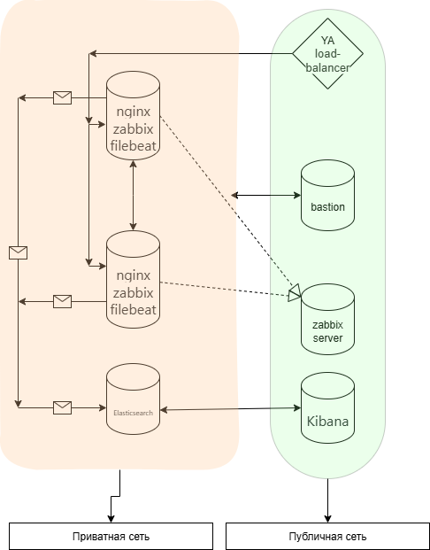

## terraform 

Подготавливаем файлы терраформ. carterra.tf - конфигурация машин. network.tf - конфигурация сети. 

### Схема  

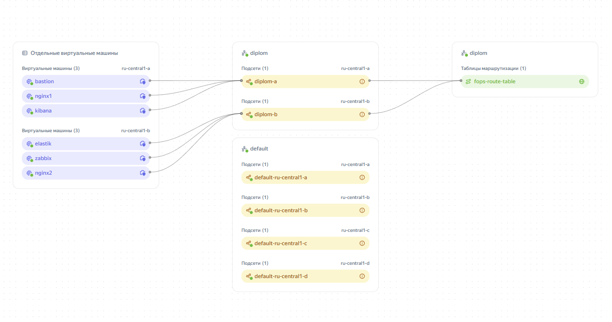


## Ansible 

Подготавливаем host файл в нем указываем fqdn имена виртуальных машин. Указывам что доступ к машинам через бастион.

```
[bastion]
\\ ip address bastion\\

[nginx_servers]
nginx1.ru-central1.internal
nginx2.ru-central1.internal

[nginx_server1]
nginx1.ru-central1.internal

[nginx_server2]
nginx2.ru-central1.internal

[zabbix_servers]
zabbix.ru-central1.internal

[elastic_servers]
elastik.ru-central1.internal

[kibana_servers]
kibana.ru-central1.internal

[all:vars]
ansible_user=*username*
ansible_ssh_private_key_file=~/.ssh/id_ed25519

[nginx_servers:vars]
ansible_ssh_common_args='-o ProxyCommand="ssh -W %h:%p -q *username*@*ip address bastion*"'

[nginx_server1:vars]
ansible_ssh_common_args='-o ProxyCommand="ssh -W %h:%p -q *username*@*ip address bastion*"'

[nginx_server2:vars]
ansible_ssh_common_args='-o ProxyCommand="ssh -W %h:%p -q *username*@*ip address bastion*"'

[zabbix_servers:vars]
ansible_ssh_common_args='-o ProxyCommand="ssh -W %h:%p -q *username*@*ip address bastion*"'

[elastic_servers:vars]
ansible_ssh_common_args='-o ProxyCommand="ssh -W %h:%p -q *username*@ip address bastion"'

[kibana_servers:vars]
ansible_ssh_common_args='-o ProxyCommand="ssh -W %h:%p -q *username*@*ip address bastion*"'
```

### Сайт 

Для установки nginx на VPS nginx1 и nginx2. Используем роль [nginxinc.nginx](https://galaxy.ansible.com/ui/standalone/roles/nginxinc/nginx/ "Ссылка на официальную роль") . Так же в директории playbook/files находяться html страницы сайта. Которые заменят стандартную. В конфигурауии у нас указан балансировщик поэтому все запросы отправляем на него. 

После уставновки сервера, проверяем работоспособность балансировщика и серверов.

Спомощью запроса curl 

```
curl *ip address Application Load Balancer*
```

Либо перейти по адресу в браузере http://*ip address Application Load Balancer*/

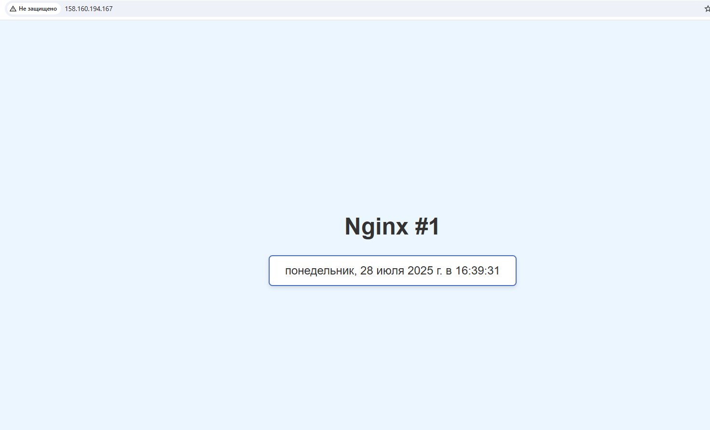

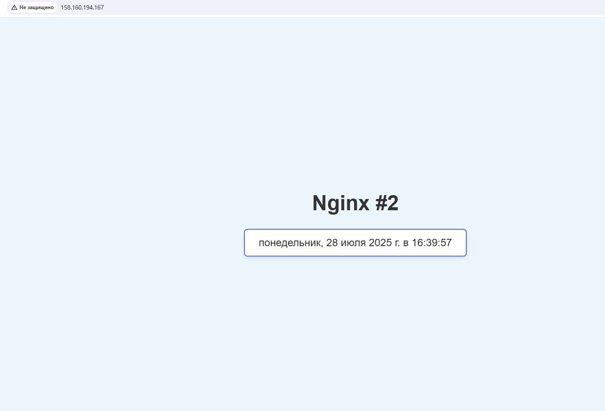


## Мониторинг

### Zabbix agent

Готовим Playbook для установки zabbix_agenta (ansible/playbok/zabbix_agent.yml). 

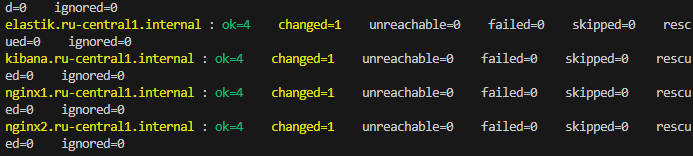

### Zabbix server

Устонавливаем сервер (ansible/plabook/zabbix_server.yml).Авторизумся. 
Сервер доступен по адрессу

```
http://*ip address VPS zabbix:8080/
```
Авторизумся.
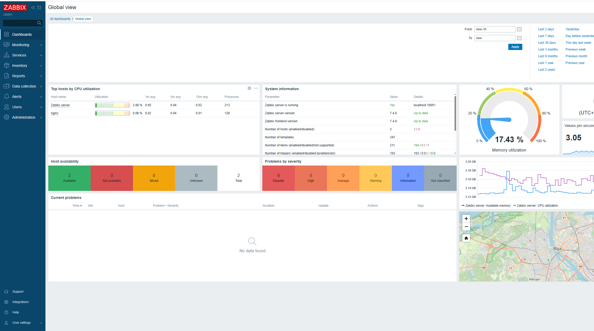

Настраиваем автоматический поиск в сетях "Zabbix-agent".
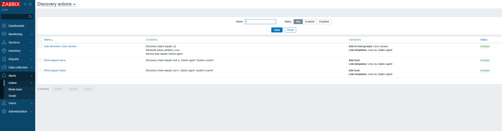
Настраиваем автоматическую регестрацию хостов.
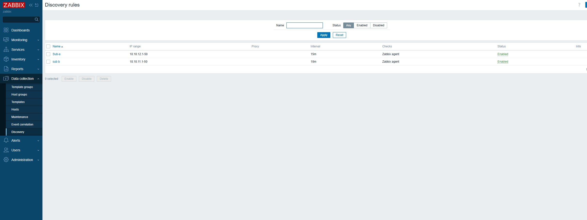
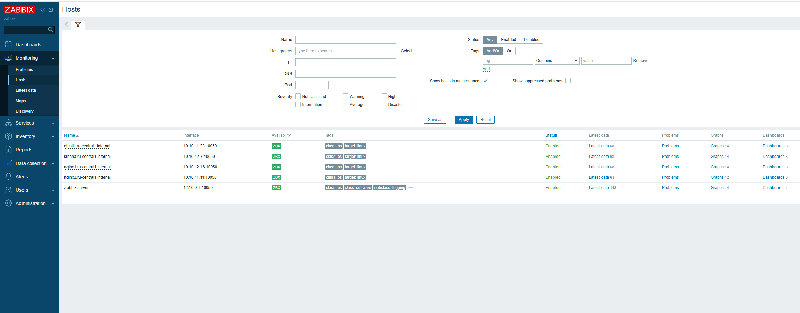

Настраиваем дашбоорт 
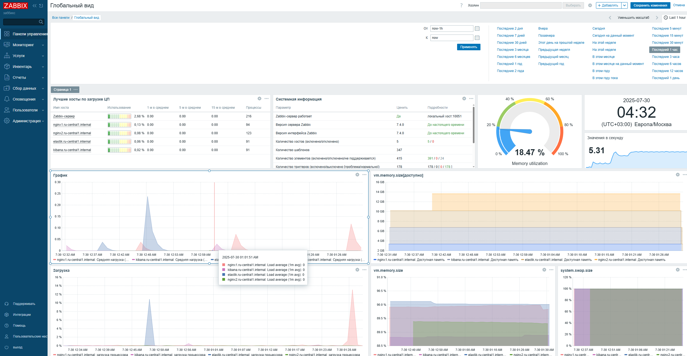


### ELK KIBNA Filebeat


Для запуска ELK, Filebiate, Kibana используем docker и образы c docker hub  [filebeat](https://hub.docker.com/r/elastic/filebeat) и [elasticsearch](https://hub.docker.com/r/elastic/elasticsearch), [Kibana](https://hub.docker.com/_/kibana) так как репазитории заблокирован. 

Готовим плейбуки. Устонавливем докер и нужные контейнеры. filebeat на web-servers. elasticsearch на elk-servers и тд. (запускаем два плейбука ELK + Filebat, Kibana)

playbook/elk.yml
playbook/kibana.yml 


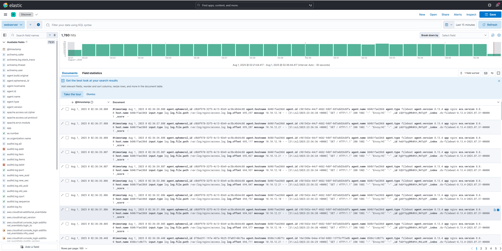


#### zabbix
```
http://84.252.138.48:8080/
```

#### kibana
```
http://62.84.117.115:5601/
```